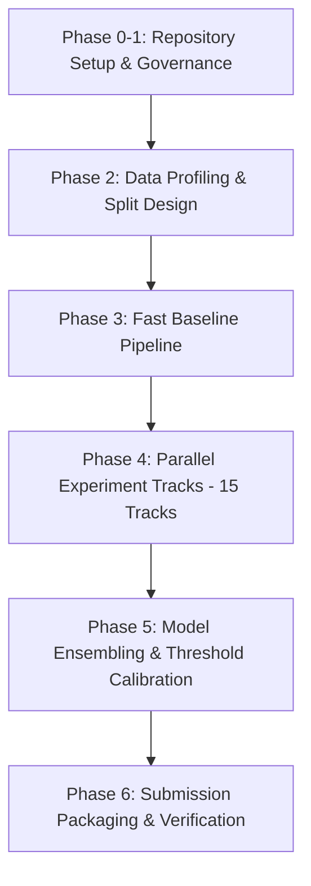

# Engineering Action Plan

A phased roadmap from repository organization to final submission packaging.

## Milestone Details

### Milestone 1: Data Profiling & Validation Design
- Characterize entity distribution, token lengths, null frequencies, and singleton ratios in `data/raw/train/`.
- Establish leak-free validation split mirroring the test distribution (including singleton frequency and country proportions).
- Implement local evaluation harness evaluating exact competition Macro $F_{0.5}$.

### Milestone 2: Baseline Blocking & Pipeline Skeleton
- Construct simple exact + lexical blocking baseline (e.g., country + name n-gram BM25).
- Build lightweight TF-IDF / fuzzy feature extractor and baseline LightGBM pairwise scorer.
- Verify end-to-end artifact generation (`candidate_pairs.tsv` and `matching_results.tsv`).
- Validate outputs using `src/business_entity_resolution/utils/validate_submission.py`.

### Milestone 3: Parallel Experimentation (15 Tracks)
- Run parallel experiments across Kaggle (6), Colab (3), Local (3), and SageMaker (3).
- Focus tracks on: blocking recall vs reduction ratio, dense semantic retrieval, deep cross-encoder rerankers, and post-processing threshold sweeps.

### Milestone 4: Ensembling & Post-Processing
- Blend diverse model families (GBDT + Transformer Cross-Encoder).
- Calibrate singleton decision boundaries to maximize Macro $F_{0.5}$.

### Milestone 5: Submission Packaging
- Package self-contained code in `submission/code/business_entity_resolution/`.
- Populate `submission/Documentation_template.md`.
- Run automated submission validator and build final reproducible `.zip`.
